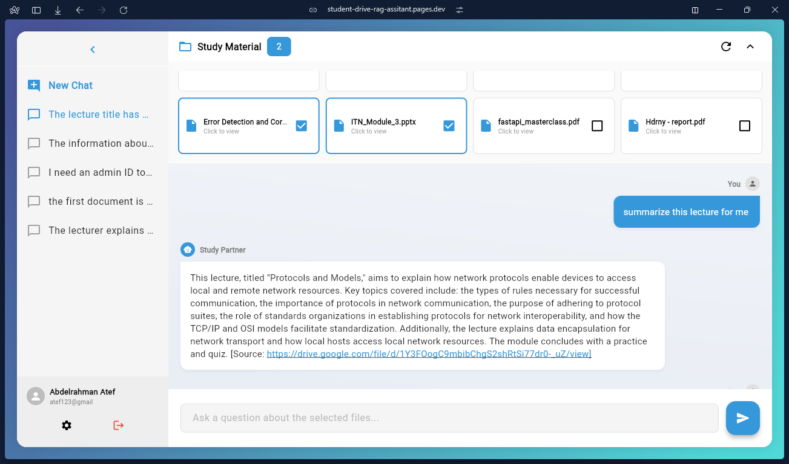
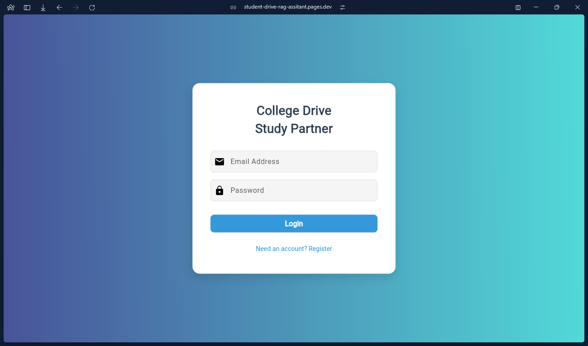

# College Drive Study Partner

**Your Personal AI Tutor, Grounded in Your Coursework.**

A smart study interface that connects directly to your Google Drive materials. Stop searching through hours of video or hundreds of PDF pages—just ask a question, and get an instant answer with citations.

---

## 🎯 The Problem
Modern students juggle massive amounts of digital content: lecture recordings, Voice Recordings, textbooks, Youtube Videos and slide decks. Finding a specific concept or verifying a fact across these different formats is time-consuming and inefficient.

## 💡 The Solution
**College Drive Study Partner** centralizes your study materials into an intelligent "Knowledge Base." It doesn't just store files; it *understands* them. By selecting specific files, students can have a focused conversation with an AI that knows exactly what was covered in class.

---

## ✨ Key Capabilities

### 1. Intelligent Context Selection
Don't want the AI to get confused by last semester's notes?
* **Visual Grid:** Browse your connected Google Drive files directly in the app.
* **Selective Focus:** Check specific boxes (e.g., "Lecture 3" + "Lab Report") to tell the AI exactly which documents to use for its answer.

### 2. Verified, Citation-Based Answers
Hallucinations are dangerous in academia.
* **Fact-Checking:** Every answer includes a specific citation (e.g., *[Source: Lecture 3.mp4 @ 12:30]*).
* **Direct Links:** Click any citation to open the original file right at the relevant page or timestamp.

### 3. Admin Knowledge Tools
Content is only as useful as it is accurate. The Admin Portal provides powerful tools to manage the curriculum:
* **Instant Ingestion:** Admins can expand the knowledge base by simply pasting a YouTube URL or syncing new Drive folders.
* **Real-Time Corrections:** If the AI generates an answer based on outdated info, Admins can issue a "Correction Command" to update the underlying database chunk instantly, all through chatting.

### 4. Role-Based Security
* **Student Mode:** A read-only, distraction-free environment for studying.
* **Admin Mode:** Write-access for professors and TAs to curate content and monitor system health, all through chat.

---

## 🚀 How It Works

1.  **Login:** Securely access your account using the Student or Admin portal.
    

2.  **Select Your Scope:** Look at the "Study Material" panel at the top. Check the boxes for the chapters or lectures you are currently studying.

3.  **Ask & Learn:** Type a question like *"What did the professor say about networking protocols in Lecture 4?"*

4.  **Review:** Watch the AI "Think" and generate a response based *only* on the files you selected.

---

*Built with ❤️ for better learning.*
